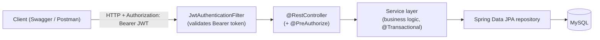
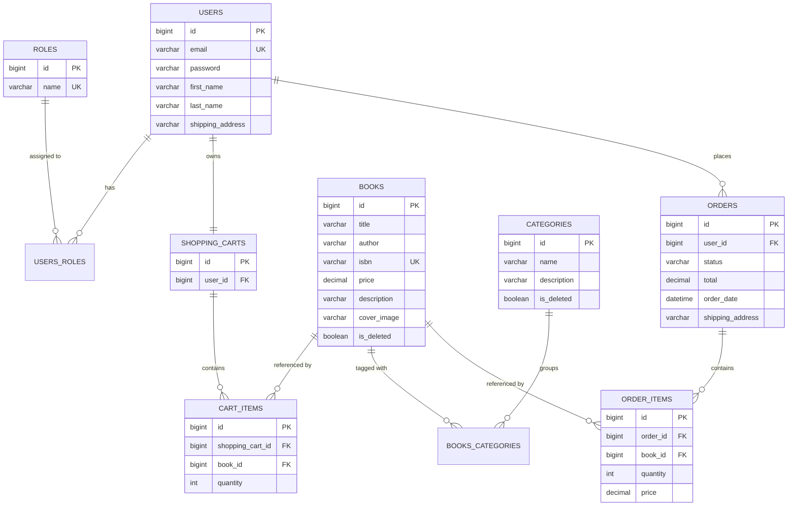

# Book Store API

[](https://github.com/AliakseiS97/book-store-spring-boot/actions/workflows/ci.yml)


A REST backend for an online bookstore. It lets shoppers browse and search a book catalog, organize books into categories, manage a personal shopping cart, and place orders that are built from the cart contents. Access is controlled with stateless JWT authentication and two roles: regular users shop and check out, while administrators manage the catalog and order fulfilment. The project is built with Spring Boot 3 and Spring Security, persists data in MySQL through Spring Data JPA with Liquibase-managed schema migrations, and ships with a Docker Compose setup and an OpenAPI/Swagger UI for exploring the API.

## Tech stack

| Technology | Purpose |
| --- | --- |
| Java 17 | Language / runtime |
| Spring Boot 3.3.5 | Application framework and auto-configuration |
| Spring Web (MVC) | REST controllers |
| Spring Security + JWT (jjwt 0.11.5) | Stateless authentication and role-based authorization |
| Spring Data JPA / Hibernate 6.4.4 | Persistence and ORM |
| MySQL 8.0 | Relational database |
| Liquibase | Versioned database schema migrations |
| MapStruct 1.5.5 | DTO ↔ entity mapping |
| Lombok | Boilerplate reduction |
| Bean Validation | Request payload validation |
| springdoc-openapi 2.3.0 | OpenAPI 3 spec and Swagger UI |
| JUnit 5 + Mockito | Unit and controller tests |
| Testcontainers 1.20.4 (MySQL) / H2 | Integration test databases |
| Maven | Build tool (wrapper included) |
| Checkstyle 3.3.0 | Static code-style enforcement (runs at `compile`) |
| Docker / Docker Compose | Containerization and local orchestration |
| GitHub Actions | Continuous integration |

## Features

### USER
- Register an account and log in to receive a JWT.
- Browse the catalog with pagination and sorting, search books by title/author/ISBN, and view book details.
- Browse categories and list the books in a category.
- Manage a personal shopping cart: add books (quantities merge when a book is added again), update item quantities, and remove items.
- Place an order from the current cart contents (the cart is cleared afterwards) and view personal order history and order items.

### ADMIN
- Create, update, and delete (soft delete) books.
- Create, update, and delete (soft delete) categories.
- Update the status of any order (`PENDING` → `COMPLETED` → `DELIVERED`).

> Roles are stored as `ROLE_USER` and `ROLE_ADMIN`. Newly registered accounts receive `ROLE_USER`.

## API endpoints

All endpoints are prefixed with the application context and require a `Authorization: Bearer <token>` header except the two authentication endpoints. Roles below reflect the `@PreAuthorize` rules in the controllers.

### Authentication — `/api/auth`

| Method | Path | Role | Description |
| --- | --- | --- | --- |
| POST | `/api/auth/registration` | Public | Register a new user; returns the created user without the password. Duplicate email → `409 Conflict`. |
| POST | `/api/auth/login` | Public | Authenticate with email + password; returns a JWT (`{ "token": "..." }`). Bad credentials → `401`. |

### Books — `/api/books`

| Method | Path | Role | Description |
| --- | --- | --- | --- |
| GET | `/api/books` | USER, ADMIN | List all books. Supports `page`, `size`, and `sort=field,asc|desc`. |
| GET | `/api/books/search` | USER, ADMIN | Filter by `titles`, `authors`, `isbns` (repeatable), with pagination and sorting. |
| GET | `/api/books/{id}` | USER, ADMIN | Get a single book by id. |
| POST | `/api/books` | ADMIN | Create a book. |
| PUT | `/api/books/{id}` | ADMIN | Update a book by id. |
| DELETE | `/api/books/{id}` | ADMIN | Soft delete a book (flips `is_deleted`); returns `204 No Content`. |

### Categories — `/api/categories`

| Method | Path | Role | Description |
| --- | --- | --- | --- |
| POST | `/api/categories` | ADMIN | Create a category. |
| GET | `/api/categories` | USER, ADMIN | List categories (paginated via `page`/`size`). |
| GET | `/api/categories/{id}` | USER, ADMIN | Get a category by id. |
| PUT | `/api/categories/{id}` | ADMIN | Update a category. |
| DELETE | `/api/categories/{id}` | ADMIN | Soft delete a category (flips `is_deleted`, hidden from later reads). |
| GET | `/api/categories/{id}/books` | USER, ADMIN | List books belonging to a category (paginated). |

### Shopping cart — `/api/cart`

The whole controller requires `ROLE_USER`; the cart is always resolved for the authenticated principal.

| Method | Path | Role | Description |
| --- | --- | --- | --- |
| GET | `/api/cart` | USER | Get the current user's cart. |
| POST | `/api/cart` | USER | Add a book with a quantity; if the book is already in the cart, its quantity is increased. |
| PUT | `/api/cart/cart-items/{cartItemId}` | USER | Update the quantity of a cart item. |
| DELETE | `/api/cart/cart-items/{cartItemId}` | USER | Remove a cart item; returns `204 No Content`. |

### Orders — `/api/orders`

| Method | Path | Role | Description |
| --- | --- | --- | --- |
| POST | `/api/orders` | USER | Place an order from the cart; clears the cart. Empty cart → `409 Conflict`. Returns `201 Created`. |
| GET | `/api/orders` | USER | Get the current user's order history (paginated, sortable). |
| PATCH | `/api/orders/{id}` | ADMIN | Update an order's status. Changing a `DELIVERED` order → `409 Conflict`. |
| GET | `/api/orders/{orderId}/items` | USER | List items of an order the user owns. |
| GET | `/api/orders/{orderId}/items/{itemId}` | USER | Get a single item of an order the user owns. |

**Notable behavior**

- **Pagination & sorting** are available on all list endpoints via Spring's `Pageable` (`?page=0&size=20&sort=title,asc`).
- **Soft delete**: books and categories are never physically removed. `@SQLDelete` rewrites deletes as `UPDATE ... SET is_deleted = true`, and `@Where(is_deleted = false)` filters them out of subsequent queries.
- **Order status transitions** are validated server-side: an order already `DELIVERED` cannot move to another status; the attempt returns `409 Conflict`.
- **Ownership checks**: order and order-item reads are scoped to the authenticated user directly in the repository queries (`findAllByUser_Id`, `findAllByOrderIdAndOrderUserId`, `findByIdAndOrderIdAndOrderUserId`), so a user cannot read another user's data by guessing ids.

## Architecture

### Request flow



### Data model



## Getting started

### Option A — Docker Compose (recommended)

Prerequisites: Docker and Docker Compose.

```bash
git clone https://github.com/AliakseiS97/book-store-spring-boot.git
cd book-store-spring-boot
cp .env.sample .env      # then fill in the values (see below)
docker compose up --build
```

The `.env` file drives both the MySQL container and the app. Variables (no real values shown):

| Variable | Meaning |
| --- | --- |
| `MYSQLDB_DATABASE` | Name of the schema MySQL creates and the app connects to. |
| `MYSQLDB_USER` | Application MySQL user. |
| `MYSQLDB_PASSWORD` | Password for `MYSQLDB_USER`. |
| `MYSQLDB_ROOT_PASSWORD` | MySQL `root` password. |
| `JWT_SECRET` | Secret used to sign/verify JWTs (HMAC-SHA). Use a long random string (32+ characters recommended). |
| `JWT_EXPIRATION` | Token time-to-live in **milliseconds**. |
| `MYSQLDB_LOCAL_PORT` | Host port mapped to MySQL (sample: `3307`). |
| `MYSQLDB_DOCKER_PORT` | MySQL port inside the Docker network (sample: `3306`). |
| `SPRING_LOCAL_PORT` | Host port mapped to the app (sample: `8088`). |
| `SPRING_DOCKER_PORT` | App port inside the container (sample: `8080`). |

Once the containers are healthy, the API is reachable on the host at `SPRING_LOCAL_PORT`. With the sample values, Swagger UI is at:

```
http://localhost:8088/swagger-ui/index.html
```

### Option B — Local Maven run

Prerequisites: JDK 17, Maven (or the bundled `./mvnw` wrapper), and a running MySQL 8.

1. Create the database expected by `src/main/resources/application.properties` (default connection is `jdbc:mysql://localhost:3306/Book_store`, user `root`, password `root`). Adjust the properties if your local setup differs. Liquibase creates all tables on startup.
2. Provide the JWT settings as environment variables — the properties reference `${JWT_SECRET}` and `${JWT_EXPIRATION}` with no defaults, so the app will not start without them:

   ```bash
   export JWT_SECRET="your-long-random-secret-string"
   export JWT_EXPIRATION=3600000
   ./mvnw spring-boot:run
   ```

   On Windows PowerShell:

   ```powershell
   $env:JWT_SECRET = "your-long-random-secret-string"
   $env:JWT_EXPIRATION = 3600000
   ./mvnw.cmd spring-boot:run
   ```

3. Swagger UI is then available at `http://localhost:8080/swagger-ui/index.html` (the app binds to `8080` locally).

### Seeded data

The Liquibase changelogs seed the two roles (`ROLE_USER`, `ROLE_ADMIN`) and one administrator account:

- **Email:** `admin@example.com`
- **Roles:** `ROLE_USER` + `ROLE_ADMIN`
- **Password:** stored only as a BCrypt hash in `06-assign-roles-to-users.yaml`; the plaintext is not committed to the repository. `TODO:` document the admin password (or reset it) before sharing.

New users can always be created through `POST /api/auth/registration`.

## API documentation (Swagger)

Interactive OpenAPI docs are served by springdoc at `/swagger-ui/index.html`, with the raw spec at `/v3/api-docs`. Authorize once with a Bearer token (from `/api/auth/login`) to call secured endpoints.


> `TODO:` add the screenshot at `docs/images/swagger.png`.

## Postman

A ready-to-use collection lives at [`postman/book-store.postman_collection.json`](postman/book-store.postman_collection.json).

1. In Postman, **Import** the file.
2. Set the collection variable `baseUrl` to your environment: `http://localhost:8080` for a local Maven run, or `http://localhost:8088` (i.e. `SPRING_LOCAL_PORT`) for the Docker Compose setup. The default is `http://localhost:8080`.
3. Send **Auth → Register** (optional) and then **Auth → Login**. The login request has a test script that reads `token` from the response and stores it in the `token` collection variable.
4. All other requests inherit Bearer `{{token}}` auth at the collection level, so they are ready to send once you are logged in.

## Challenges & solutions

- **N+1 queries when loading the cart** → `ShoppingCartRepository.findByUserId` uses `@EntityGraph(attributePaths = {"cartItems", "cartItems.book"})` to fetch the cart, its items, and their books in a single query instead of one query per item.
- **Entity `equals()`/`hashCode()` in collections** → entities that participate in associations/`Set`s (`ShoppingCart`, `CartItem`, `Order`, `OrderItem`) use `@EqualsAndHashCode(onlyExplicitlyIncluded = true)` with only the `id` included, plus `@ToString` exclusions on back-references. This keeps identity stable and avoids infinite recursion across bidirectional relationships.
- **Order ownership security** → instead of loading an order and then checking its owner, the repository queries themselves are scoped by user id (`findAllByOrderIdAndOrderUserId`, `findByIdAndOrderIdAndOrderUserId`), so cross-user access simply returns nothing.
- **Invalid order status transitions** → `OrderServiceImpl.validateStatusTransition` rejects moving a `DELIVERED` order to any other status by throwing `IllegalStateException`, which the global exception handler maps to `409 Conflict` (the same handler also turns "order from an empty cart" into `409`).
- **Docker build issues** → the multi-stage Dockerfile explicitly copies `checkstyle.xml` into the build stage because Checkstyle runs at the `compile` phase and needs the config inside the build context; and the app requires `JWT_SECRET`/`JWT_EXPIRATION` to be supplied via `.env`, otherwise startup fails resolving the property placeholders.

## Testing

Run the unit and controller tests:

```bash
./mvnw test
```

Run the full verification (Checkstyle + all tests, including Testcontainers-backed repository tests — requires Docker):

```bash
./mvnw verify
```

The suite includes:

- **Service unit tests** (Mockito): `BookServiceImplTest`, `CategoryServiceImplTest`, `ShoppingCartServiceImplTest`.
- **Controller tests** (`@WebMvcTest` + MockMvc with mocked services): `BookControllerTest`, `CategoryControllerTest`, `ShoppingCartControllerTest`.
- **Repository tests** (`@DataJpaTest` against a real MySQL via Testcontainers): `BookRepositoryTest`, `ShoppingCartRepositoryTest`.

CI runs `mvn --batch-mode --update-snapshots verify` on every push and pull request against a MySQL 8 service container (see `.github/workflows/ci.yml`).

## Video demo

`TODO:` add Loom link.

## Author

**Aliaksei Shyhala**

- GitHub: [AliakseiS97](https://github.com/AliakseiS97)
- LinkedIn: [linkedin.com/in/aliaksei-shyhala](https://linkedin.com/in/aliaksei-shyhala)
